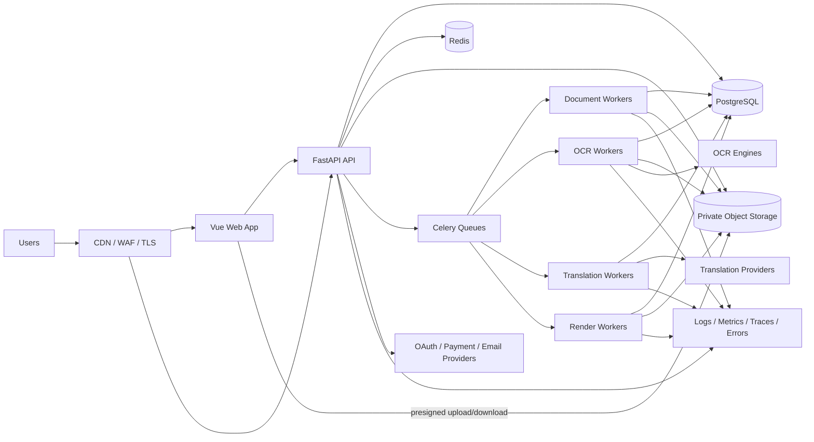
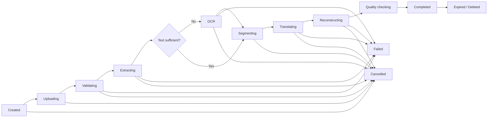
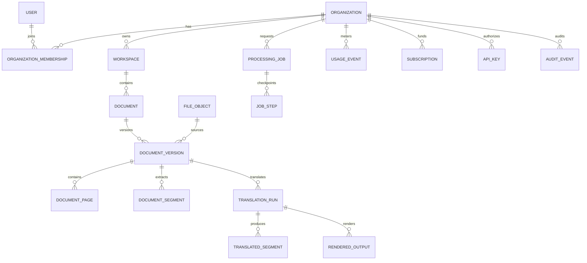

# Aikya AI — Technical Architecture and Development Blueprint

Status: Proposed for review  
Version: 1.0  
Date: 2026-08-01  
Scope: Step 1 — architecture and planning only; no implementation

## 1. Executive decision

Aikya AI should begin as a **modular monolith with independently scalable worker processes**, not as microservices. The web API, business modules, and provider abstractions remain one codebase and one transactional PostgreSQL database. CPU/GPU-heavy document, OCR, translation, and rendering work runs asynchronously through queues and can scale separately without creating distributed-system complexity in the domain layer.

The product's technical core is not a generic “upload, translate, download” flow. It is a versioned **Document Intermediate Representation (Document IR)** that records pages, blocks, reading order, text, tables, images, bounding boxes, and style metadata. Parsers convert each input format into this canonical model; translation operates on stable segments; renderers produce output formats. This is the foundation for layout preservation, comparisons, retries, provider switching, and future editors.

The initial production slice is the web product only:

- Authentication, a personal workspace, and document history.
- Plain-text translation.
- DOCX and digitally generated PDF ingestion, translation, and export.
- A bounded OCR path for images and scanned PDFs.
- Progress, failures, cancellation, retention controls, and usage accounting.

Browser extension, live camera, resume intelligence, audio, public API, mobile, desktop, billing, and enterprise features are planned extension points, not simultaneous MVP work.

## 2. Resolved requirements and assumptions

### 2.1 Authoritative choices

- Product name: **Aikya AI**.
- Tagline: **One World. One Understanding.**
- Frontend: Nuxt 4, Vue 3, TypeScript, Pinia, Tailwind CSS, SCSS, Nuxt Content, VueUse, and typed Axios services. Public routes use SSR/prerendering; private workspace routes are client-rendered.
- Backend: Python, FastAPI, SQLAlchemy, Alembic.
- Data: PostgreSQL as the system of record; Redis for cache, rate limits, and queue transport.
- Jobs: Celery initially, with idempotent tasks and PostgreSQL-persisted job state.
- Binary storage: private S3-compatible object storage, initially Cloudflare R2 or AWS S3.
- Architecture: modular monolith first, with separable workers.
- AI: optional and isolated from core translation.
- Other clients: Vue + Manifest V3 extension, Tauri + Vue desktop, and a Vue-based mobile client later.

References to Lingora, React, Next.js, React Native, and Electron in earlier material are treated as superseded ideas, not current requirements.

### 2.2 Product claims that must be constrained

“Preserve the original layout” cannot honestly mean pixel-perfect output for every PDF. PDFs often contain positioned glyphs rather than semantic paragraphs, translated text expands or contracts, target fonts may lack glyphs, and scanned pages have no editable source structure. The product contract should therefore use fidelity levels:

1. **Structure-preserving:** semantic elements and editable formatting are retained, best for DOCX, PPTX, XLSX, HTML, and EPUB.
2. **Visual-preserving:** translated text is fitted into original regions, best for digitally generated PDFs.
3. **Overlay reconstruction:** OCR regions are cleaned and overlaid, used for scanned PDFs and images.
4. **Readable fallback:** when reconstruction confidence is low, produce a clean translated document plus side-by-side view rather than a misleading broken replica.

Every output should expose a fidelity/quality result and warnings. The UI and marketing must say “preserve layout as much as possible,” not guarantee perfect preservation.

### 2.3 MVP limits to decide before implementation

Recommended beta defaults, subject to product approval:

- 50 MB per file and 100 pages per document.
- PDF, DOCX, TXT, PNG, and JPEG only; other promised formats follow after pipeline stability.
- One source and one target language per translation run.
- Password/email and Google OAuth at launch; GitHub only if user research supports it.
- Unsaved source and derived files expire 24 hours after completion; saved documents use user-selected retention.
- No user document content used for model training.
- No medical/legal accuracy claim; translated output is assistive, not certified.

## 3. Architecture principles

1. **Tenant ownership is explicit.** Every business record belongs to an organization tenant. A new individual receives a personal organization, eliminating ambiguous nullable ownership.
2. **PostgreSQL is authoritative.** Redis and Celery are delivery mechanisms, never the sole record of job status, quota, or billing.
3. **At-least-once work must be safe.** Every job stage is idempotent, resumable, and identified by a deterministic key.
4. **Files stay outside the database.** PostgreSQL stores metadata and object keys; encrypted private object storage holds binaries.
5. **Provider independence is real.** Translation, OCR, AI, and speech providers implement internal contracts. Provider-specific data does not leak into domain models.
6. **Privacy is a lifecycle.** Collection, transfer, processing, retention, export, and deletion are designed together.
7. **Observability excludes content.** Logs and traces use IDs and metrics, never extracted text, tokens, document names, or signed URLs.
8. **Scale by measurement.** Extract a module only when load, fault isolation, release cadence, or ownership makes the boundary valuable.
9. **Contracts are generated.** OpenAPI is the source for typed web/extension/mobile SDK clients; shared runtime code is not copied across Python and TypeScript.
10. **Accessibility and internationalization are foundational.** RTL, Unicode, pluralization, locale-aware dates/numbers, keyboard use, and screen readers are acceptance criteria.

## 4. System context and deployable topology



### 4.1 Initial deployable units

| Unit | Responsibility | Scale signal |
|---|---|---|
| `web` | Vue SPA and static assets | Request volume/CDN cache misses |
| `api` | Auth, metadata, orchestration, signed URLs, synchronous text translation | HTTP latency and concurrency |
| `worker-document` | Validation, parsing, segmentation | Queue age, CPU, file mix |
| `worker-ocr` | OCR and image preprocessing; separate CPU/GPU pool | Queue age, GPU/CPU saturation |
| `worker-translation` | Batching, provider calls, translation memory | Provider rate limits and latency |
| `worker-render` | Reconstruction, font fitting, output generation, quality checks | CPU/memory and queue age |
| `scheduler` | Retention, cleanup, rollups, stuck-job recovery | Single active scheduler with lock |
| PostgreSQL | Transactional data and durable state | IOPS, connections, query latency |
| Redis | Celery broker, short cache, locks, rate limiting | Memory, eviction, connection load |
| Object storage | Source, intermediate, output, thumbnail, audio binaries | Storage/egress volume |

The units can initially run from one backend image with different commands. This gives operational separation without creating independent services.

### 4.2 Request versus job boundary

Keep synchronous operations under a strict time budget: authentication, metadata reads/writes, signed URL creation, language discovery, and short text translation. File scanning, parsing, OCR, large translation, rendering, audio, and deletion are asynchronous.

The API acknowledges document processing with `202 Accepted` and a durable job resource. The client polls initially; Server-Sent Events can later stream progress without requiring bidirectional WebSockets.

## 5. Backend module boundaries

Each module owns its domain rules, tables, application use cases, and API routes. Modules may call another module only through its public application interface or domain events—never through the other module's repositories.

| Module | Owns | Does not own |
|---|---|---|
| Identity | credentials, OAuth identities, sessions, token rotation, verification | organization permissions |
| Users | profiles, locale, preferences, deletion requests | authentication secrets |
| Organizations | tenants, memberships, teams, invitations, RBAC | login sessions |
| Workspaces | workspaces, folders, projects, sharing policy | file bytes |
| Documents | document lifecycle, versions, Document IR, imports/exports | translation vendor logic |
| Jobs | orchestration state machine, attempts, progress, cancellation | business transformation logic |
| Translation | language detection, segmentation policy, provider routing, glossary, translation memory | file reconstruction |
| OCR | image preprocessing, engine routing, OCR runs and confidence | final translated output |
| Rendering | format-specific reconstruction, fonts, visual QA, output artifacts | source ownership |
| AI | optional explain/summarize/rewrite tasks, prompt versions, safety policy | core translation requirement |
| Audio | TTS runs and audio artifacts | translated source of truth |
| Storage | object metadata, signed access, scanning/quarantine, retention/deletion | document semantics |
| Usage | immutable metering ledger, quota checks, aggregates | payment collection |
| Billing | plans, subscriptions, invoices, entitlements, provider webhooks | raw metering events |
| Notifications | in-app/email delivery and preferences | job truth |
| Developer API | API keys, scopes, external request idempotency, webhooks | human login |
| Audit | append-only security/business events and export | application logs |
| Admin | support tools with reason capture and strict audited access | unrestricted document viewing |

Cross-module events use a transactional outbox table. A transaction writes business state and an outbox record together; a dispatcher publishes it after commit. This prevents “database updated but task/event lost” failures.

## 6. Document processing architecture

### 6.1 Canonical Document IR

The Document IR is versioned and format-neutral. It contains:

- Document metadata: source type, language, page/slide/sheet count, parser and schema versions.
- Containers: pages, sections, slides, sheets, headers, footers.
- Blocks: paragraphs, headings, lists, cells, text boxes, captions, footnotes, links, and form fields.
- Geometry: page dimensions, rotation, bounding boxes, z-order, and transform.
- Reading order and parent/child relationships.
- Text runs: original Unicode text, normalized text, language, style references, and inline boundaries.
- Assets: image/font references and reuse information.
- Translation segments: stable IDs, context, neighboring segment IDs, protected tokens, and source hashes.
- Quality metadata: extraction confidence, OCR confidence, overflow, missing glyphs, and warnings.

Large IR payloads and renderer intermediates belong in versioned object storage; queryable metadata and segment rows belong in PostgreSQL. JSONB may carry format-specific style/geometry details but must not become an unvalidated dumping ground; every IR version has a schema and migration/compatibility policy.

### 6.2 End-to-end state machine



Processing steps:

1. API creates an upload intent after entitlement and quota preflight.
2. Browser uploads directly to a private quarantine prefix with a short-lived signed request.
3. Client completes the upload; server verifies ownership, expected size, checksum, MIME signature, and extension.
4. Antivirus scanning and archive-bomb checks run before parsers access the file.
5. Parser creates a source version and Document IR.
6. OCR runs only on pages/regions with insufficient embedded text; engine choice depends on language/script and benchmark results.
7. Segmenter protects URLs, numbers, placeholders, code, formulas, and style boundaries; it adds document context without leaking unrelated content.
8. Translation router selects a provider by language pair, plan, privacy mode, quality tier, health, latency, and cost. Requests are batched within provider limits.
9. Renderer fits translated runs, applies font fallback, detects overflow/collision, and chooses fidelity or readable fallback output.
10. Automated quality checks validate page count, non-empty output, language, untranslated ratio, glyph coverage, overflow, and corruption.
11. Output is atomically published, usage is finalized from actual units, and a completion event triggers notification.

Each stage checkpoints durable state. Retryable failures use bounded exponential backoff with jitter; permanent failures return a stable user-safe error code. A dead-letter workflow retains metadata for diagnosis but not document text in logs.

### 6.3 Translation provider contract

Internal provider adapters expose capabilities, language pairs, batch limits, glossary support, document support, privacy classification, health, estimate, translate, and normalized error mapping. Routing is policy-based rather than a hardcoded fallback chain.

Translation runs capture provider, provider model/version when available, adapter version, segmentation version, glossary version, source hash, target locale, and settings. This makes outputs reproducible and cacheable. A provider result cache key must include all of those dimensions and must be tenant-aware where data isolation requires it.

Self-hosted translation is a later adapter, not a separate product path. AI rewriting must never silently replace deterministic translation; users explicitly opt into an AI action and see it as a distinct output/version.

### 6.4 Format strategy

| Format | Extraction strategy | Output strategy | Initial fidelity target |
|---|---|---|---|
| TXT/Markdown | encoding detection, text parser | regenerated text | semantic |
| DOCX | paragraphs, runs, styles, tables, headers/footers | clone package and replace mapped runs | high structural fidelity |
| Digital PDF | positioned spans plus reading order heuristics | redact/repaint text or regenerated companion PDF | visual fidelity with warnings |
| Scanned PDF/image | preprocess + region OCR | translated overlay and side-by-side | region fidelity |
| PPTX | text frames, notes, masters | clone and resize/fit text | later phase |
| XLSX | cells, formulas, comments, shared strings | clone and replace translatable values only | later phase |
| HTML | sanitized DOM and visible text nodes | sanitized translated document | later phase |
| EPUB | unpacked XHTML/resources/manifest | rebuilt valid EPUB | later phase |

Never modify source files in place. Each ingestion, translation, enhancement, and render creates immutable versions linked by lineage.

## 7. Repository and folder structure

```text
aikya/
├── apps/
│   ├── web/                         # Vue 3 customer web application
│   │   ├── src/
│   │   │   ├── app/                # bootstrap, router, providers, global guards
│   │   │   ├── assets/
│   │   │   ├── components/         # truly reusable presentation components
│   │   │   ├── features/           # auth, documents, translation, billing, settings
│   │   │   ├── layouts/
│   │   │   ├── pages/
│   │   │   ├── services/           # generated API client wrappers, telemetry
│   │   │   ├── stores/             # Pinia stores for client state only
│   │   │   ├── i18n/
│   │   │   ├── styles/
│   │   │   ├── types/
│   │   │   └── utils/
│   │   ├── tests/{unit,component,e2e}/
│   │   └── public/
│   ├── extension/                   # created only when extension phase starts
│   ├── mobile/                      # created only when mobile phase starts
│   └── desktop/                     # created only when desktop phase starts
├── backend/
│   ├── src/aikya/
│   │   ├── main.py                  # FastAPI composition root only
│   │   ├── bootstrap/               # dependency wiring, lifecycle, route registration
│   │   ├── config/                  # validated settings and environment policy
│   │   ├── platform/                # db, cache, queue, telemetry, mail, clock, IDs
│   │   ├── shared/                  # small cross-domain primitives and errors
│   │   └── modules/
│   │       ├── identity/
│   │       ├── users/
│   │       ├── organizations/
│   │       ├── workspaces/
│   │       ├── documents/
│   │       ├── jobs/
│   │       ├── translation/
│   │       ├── ocr/
│   │       ├── rendering/
│   │       ├── ai/
│   │       ├── audio/
│   │       ├── storage/
│   │       ├── usage/
│   │       ├── billing/
│   │       ├── notifications/
│   │       ├── developer_api/
│   │       ├── audit/
│   │       └── admin/
│   ├── migrations/
│   ├── tests/{unit,integration,contract,pipeline,security}/
│   └── worker_entrypoints/
├── packages/
│   ├── api-client/                  # generated TypeScript client from OpenAPI
│   ├── contracts/                   # schemas/artifacts, not duplicated business logic
│   ├── ui/                          # shared Vue design system when a second client needs it
│   └── eslint-config/
├── quality-fixtures/
│   ├── documents/                   # licensed/synthetic golden inputs
│   ├── expected/                    # expected text, geometry, and screenshots
│   └── benchmarks/
├── infrastructure/
│   ├── docker/
│   ├── environments/{local,staging,production}/
│   ├── terraform/                   # when the hosting target is chosen
│   ├── monitoring/
│   └── runbooks/
├── docs/
│   ├── 01-product-vision.md
│   ├── 02-requirements.md
│   ├── 03-technical-blueprint.md
│   ├── 04-database.md
│   ├── 05-api-spec.md
│   ├── 06-document-ir.md
│   ├── 07-security-privacy.md
│   ├── 08-ui-ux.md
│   ├── 09-testing-quality.md
│   ├── 10-operations.md
│   └── decisions/                   # ADRs
├── scripts/                         # bounded developer/CI automation
├── tests/e2e/                       # cross-system acceptance tests
├── .github/workflows/
├── .env.example                     # names and safe defaults only
├── compose.yaml                     # local dependencies
├── Makefile                         # or one cross-platform task runner
└── README.md
```

Inside each backend module, use a pragmatic four-part shape:

```text
module/
├── domain/          # entities, value objects, policies, domain events
├── application/     # commands, queries, ports, DTOs
├── infrastructure/  # SQLAlchemy repositories and provider adapters
└── presentation/    # FastAPI routes and request/response schemas
```

Do not force every trivial feature through unnecessary abstractions. Provider-heavy modules benefit from ports/adapters; simple CRUD can remain direct application services. The domain must not import FastAPI, SQLAlchemy, Celery, or vendor SDKs.

Quasar should not be mixed into the web design system by default. Tailwind plus accessible headless primitives is the primary web approach; add Quasar only for a proven component need or use it within the later mobile client. The marketing site can be static at first; if organic search becomes important, add a separately rendered marketing surface rather than replacing the authenticated Vue application.

## 8. PostgreSQL data design

### 8.1 Conventions

- Application-generated UUIDs, `timestamptz` in UTC, lowercase BCP 47 language tags, and monetary amounts in integer minor units.
- Every mutable table includes `created_at` and `updated_at`; soft deletion is limited to entities requiring recovery. File erasure uses explicit lifecycle state rather than pretending a soft delete removes private data.
- Tenant-owned tables include `organization_id`, indexed first in tenant queries and enforced in repository methods. Add PostgreSQL row-level security as defense in depth before business/enterprise multi-tenancy goes live.
- User-facing resources have opaque IDs. Sequential database IDs are never exposed.
- Enumerated state transitions are validated in application logic and protected with check constraints where practical.
- Secrets are stored in a secrets manager. Database rows contain only hashes, encrypted tokens when unavoidable, or secret references.
- High-volume immutable tables (`usage_events`, `audit_events`) are partition-ready by month and organization.
- JSONB is reserved for bounded metadata with application schemas; relational columns hold searchable and integrity-critical values.

### 8.2 Identity and tenancy

| Table | Important fields and constraints |
|---|---|
| `users` | `id`, unique normalized email, display name, locale, timezone, status, email_verified_at, last_login_at, deleted_at |
| `auth_identities` | user, provider, provider_subject; unique `(provider, provider_subject)`; password hash only for local identity |
| `sessions` | user, refresh-token hash/family, device metadata, expires/revoked timestamps; no raw token |
| `organizations` | id, type `personal/business`, name, slug, status, data_region; unique active slug |
| `organization_memberships` | organization, user, role, status, invited_by; unique `(organization_id, user_id)` |
| `teams` | organization, name, description; unique active name within organization |
| `team_memberships` | team, membership, role; unique pair |
| `invitations` | organization, email, role, token hash, expiry, accepted/revoked timestamps |
| `workspaces` | organization, name, visibility, created_by |
| `workspace_memberships` | workspace, organization membership, role; unique pair |
| `user_preferences` | user, UI locale, theme, defaults, validated preferences JSON |
| `organization_settings` | organization, retention policy, allowed providers, privacy mode, validated settings JSON |

Roles should initially be fixed (`owner`, `admin`, `member`, `viewer`, plus narrowly scoped support roles). Permissions are code-defined and tested; arbitrary custom roles wait for enterprise demand.

### 8.3 Documents, files, and processing

| Table | Important fields and constraints |
|---|---|
| `folders` | organization, workspace, parent folder, name; cycle-safe hierarchy |
| `documents` | organization, workspace, folder, created_by, title, kind, source language, lifecycle status, retention policy, expires_at |
| `document_versions` | organization, document, version number, source file, IR file, parser/schema version, page count, source hash; unique `(document_id, version_no)` |
| `file_objects` | organization, purpose, provider/bucket/key, MIME, extension, bytes, checksum, encryption key reference, scan status, lifecycle status, expires/deleted timestamps; unique object key |
| `document_pages` | organization, version, page index, dimensions, rotation, thumbnail file, extraction status; unique `(version_id, page_index)` |
| `document_segments` | organization, version, page, stable segment key, parent, kind, reading order, original text, normalized source hash, language, geometry/style JSON, extraction confidence |
| `processing_jobs` | organization, resource type/id, job type, state, progress, requested/cancelled/by timestamps, started/completed timestamps, error code, idempotency key, priority; unique scoped idempotency key |
| `job_steps` | job, stage, attempt, state, worker correlation ID, timing, checkpoint file, normalized error metadata; unique `(job_id, stage, attempt)` |
| `ocr_runs` | organization, version/page, engine/engine version, languages, settings hash, status, aggregate confidence, timing |
| `rendered_outputs` | organization, translation run, format, file object, renderer/version, fidelity tier, quality score, warnings JSON |
| `deletion_requests` | organization, actor, target, reason, state, scheduled/completed timestamps, failure summary |

Indexes should support `(organization_id, workspace_id, created_at desc)`, job recovery by `(state, heartbeat_at)`, retention by `(lifecycle_status, expires_at)`, and segment lookup by `(document_version_id, reading_order)`. Do not index full document text until a defined search feature and privacy review exist.

### 8.4 Translation and language intelligence

| Table | Important fields and constraints |
|---|---|
| `languages` | canonical BCP 47 tag, English/native names, script, direction, active flag |
| `provider_capabilities` | provider, capability, source/target tags, quality tier, privacy class, limits, effective dates |
| `translation_runs` | organization, document version or text request, source/target tag, mode, provider, adapter/model/segmenter versions, glossary, settings hash, status, estimated/actual units, quality summary |
| `translated_segments` | organization, run, source segment, translated text, status, confidence/quality signals, source hash, provider request reference; unique `(run_id, source_segment_id)` |
| `glossaries` | organization, name, source/target tags, version, status |
| `glossary_entries` | glossary, source term, target term, match policy, case sensitivity; uniqueness defined per glossary/version |
| `translation_memory_entries` | organization, source/target tags, normalized source hash, source/target text, context hash, provenance, quality, last_used_at |
| `ai_runs` | organization, source resource, action, provider/model, prompt template version, consent/privacy mode, input/output file references or bounded result, usage, status |
| `audio_runs` | organization, source resource, provider/voice/locale, settings hash, output file, usage, status |

Translation memory is organization-private by default. A global cache may store only provider-licensed, non-sensitive normalized phrases after explicit legal/privacy review; it is not an MVP assumption.

### 8.5 Entitlements, usage, billing, and external API

| Table | Important fields and constraints |
|---|---|
| `plans` | code, version, currency, billing interval, active dates, public metadata |
| `plan_entitlements` | plan version, feature key, hard/soft limit, unit, reset cadence |
| `subscriptions` | organization, billing provider, customer/subscription refs, plan version, state, period and cancellation timestamps |
| `billing_events` | provider event ID unique, received/processed timestamps, signature result, status, payload reference/redacted payload |
| `invoices` | organization, provider invoice ref, amount/currency/state, hosted URL, period timestamps |
| `payments` | organization, provider payment ref, invoice, amount/currency/state; never card data |
| `usage_events` | organization, actor/client, feature, quantity, unit, resource, occurred_at, idempotency key; append-only and uniquely idempotent |
| `usage_rollups` | organization, feature, period, quantity; unique period key, reproducible from ledger |
| `quota_reservations` | organization, job, feature, estimated units, state, expiry; prevents concurrency overspend |
| `api_keys` | organization, creator, name, visible prefix, secret hash, scopes, last_used/expires/revoked timestamps |
| `webhook_endpoints` | organization, encrypted signing-secret reference, URL, subscribed events, state |
| `webhook_deliveries` | endpoint, event, attempt, response status, next attempt, state; payload contains IDs, not document text |

Usage must be an immutable ledger. Reserve estimated units before a large job, then release or settle against actual pages/characters. Billing provider webhooks are signature-verified, idempotent, and processed asynchronously.

### 8.6 Operations and trust

| Table | Important fields and constraints |
|---|---|
| `notifications` | organization/user, type, resource, title/body key and params, read timestamp, delivery state |
| `notification_preferences` | user, channel, event type, enabled |
| `audit_events` | organization, actor type/id, action, target type/id, outcome, request ID, IP/user-agent fingerprints as policy allows, redacted metadata, timestamp; append-only |
| `outbox_events` | aggregate, event type, schema version, redacted payload, created/published timestamps, attempts |
| `idempotency_records` | organization/actor, key, request hash, response reference/status, expiry; unique scope/key |
| `provider_health_events` | provider/capability, status, latency/error aggregates, window; operational metadata only |
| `feature_flags` | environment/organization targeting, key, validated config, active dates |

Audit logs and operational logs are separate: audit answers “who changed/accessed what”; logs diagnose software. Neither should contain source or translated text.

### 8.7 Key relationships



## 9. API architecture

### 9.1 Contract rules

- Version public resources under `/api/v1`; do not version internal Python interfaces by URL.
- Use JSON for metadata and presigned object-storage transfer for large binaries.
- Require `Idempotency-Key` on create/charge/job-trigger endpoints.
- Return a consistent error envelope with stable code, safe message, request ID, field errors, and retryability.
- Cursor pagination for histories; never offset pagination for growing ledgers.
- Conditional updates use an entity version or `If-Match` to prevent lost writes.
- Dates are ISO 8601 UTC, languages are BCP 47, sizes are bytes, money is minor units plus currency.
- Generate the TypeScript client and validate backward compatibility in CI.

### 9.2 Initial resource surface

| Area | Representative operations |
|---|---|
| Identity | register, login, OAuth callback, refresh, logout, verify email, password recovery, session list/revoke |
| Organizations | current organization, memberships, invitations, active organization selection |
| Workspaces | list/create/update workspaces and folders subject to permissions |
| Uploads | create upload intent, complete/abort upload, request authorized download URL |
| Documents | create/list/get/update/delete document, versions, pages, retention choice |
| Text translation | estimate and translate bounded text synchronously or as job above threshold |
| Document translation | estimate, create run, get status/progress, cancel/retry, list outputs |
| Jobs | status, steps visible at a safe level, cancellation, retry where supported |
| Languages | supported language/capability matrix by feature and quality tier |
| Usage | current allowance, reservations, period totals |
| Notifications | list, mark read, preferences |

Public developer APIs later use the same application use cases but a separate authentication/rate-limit surface. They must not simply expose internal dashboard endpoints.

## 10. Security and privacy architecture

### 10.1 Authentication and authorization

- For web, use a short-lived access token kept in memory and a rotating refresh token in a `Secure`, `HttpOnly`, `SameSite` cookie, or use an opaque server session. Never store long-lived bearer tokens in local storage.
- OAuth uses Authorization Code + PKCE and validates state, nonce, issuer, audience, and redirect URI.
- Local passwords use a modern adaptive password hash such as Argon2id, verified email, breached-password controls, generic auth errors, and rate limits.
- RBAC checks occur in application use cases, not only routers. Every repository query carries tenant scope. Object storage authorization is derived from database ownership, never from a user-supplied key.
- Sensitive support/admin actions require step-up authentication, explicit reason, time-bounded access, and audit records.

### 10.2 File and pipeline security

- Upload to quarantine; validate magic bytes, extension, size, page count, compression ratio, and file structure.
- Malware scan before parsing. Treat PDF, Office, HTML, EPUB, SVG, and archives as untrusted active content.
- Disable macros/external links, prevent path traversal and XML external entity expansion, cap decompression and parser resources, and run parsers/renderers in isolated containers with read-only filesystems, no unnecessary network, CPU/memory/time limits, and ephemeral scratch space.
- Use randomized object keys, private buckets, TLS, server-side encryption, short signed URL expiry, and separate quarantine/clean/output prefixes or buckets.
- Egress policy allows a worker to contact only the selected provider. Provider request content follows the organization's privacy policy and user disclosure.

### 10.3 Data lifecycle

- Record the legal/operational purpose and retention class for each file type.
- Default to minimal retention. Expiry jobs delete source, intermediates, derived files, search copies, and cache entries, then mark verifiable tombstones.
- Account deletion is an orchestrated, retryable process with exceptions only for legally required billing records; those records are minimized and isolated.
- Backups require documented expiry and deletion behavior. Product copy must explain that deletion from active systems and backup expiry are different timelines.
- Data export and deletion actions are authenticated, authorized, audited, and protected against CSRF/replay.

### 10.4 Baseline controls

- TLS/HSTS, CSP, secure headers, CSRF protection where cookies authenticate, strict CORS allowlist.
- Per-IP, per-user, per-organization, and per-API-key rate limits plus job concurrency limits.
- Secrets manager, key rotation, separate environment credentials, least-privilege IAM, and no secrets in repository or images.
- Dependency/image scanning, signed builds where practical, SBOM generation, protected branches, review, and migration checks.
- Encrypted backups with tested restore; staging uses synthetic data, never copied production documents.
- Incident response, key compromise, provider outage, data deletion failure, and queue backlog runbooks before public launch.

Compliance labels such as “GDPR compliant,” “SOC 2,” or “HIPAA” require actual legal/operational programs; architecture alone does not earn them.

## 11. Reliability, scalability, and observability

### 11.1 Initial service objectives

Proposed beta targets:

- API availability: 99.5% monthly, excluding announced maintenance.
- Metadata API latency: p95 below 300 ms under the supported load; file transfer excluded because it goes directly to object storage.
- Accepted job durability: no acknowledged job lost.
- Job progress freshness: updated at stage transitions and at bounded intervals during long stages.
- Recovery: stuck jobs detected by heartbeat and safely retried; duplicate delivery produces no duplicate charge/output.
- MVP recovery objectives: RPO up to 24 hours and RTO up to 4 hours, tightened before enterprise sales.

Translation completion time is not a single honest SLO because it varies with pages, OCR, format, language, and provider. Benchmark and publish size/fidelity-specific targets after representative fixtures exist.

### 11.2 Scaling path

1. Stateless API replicas and direct-to-object-storage transfers.
2. Separate Celery queues by workload, priority, plan, and resource profile; independent worker autoscaling.
3. Translation batching, bounded cache, quota reservation, and provider circuit breakers.
4. PostgreSQL connection pooling, query/index review, read replicas for reporting only, and partitioned audit/usage ledgers.
5. Dedicated GPU OCR/self-hosted model pool only when utilization economics justify it.
6. Extract a service only when there is a measurable bottleneck or isolation requirement. Likely first candidates are OCR/rendering (resource isolation) and public translation API (independent traffic/security), not identity or billing.

Redis as a Celery broker is acceptable initially if tasks are idempotent and durable state stays in PostgreSQL. If queue durability, routing, or operational behavior becomes limiting, migrate transport to a managed queue or RabbitMQ without changing domain contracts.

### 11.3 Telemetry

- Structured logs: timestamp, level, service, environment, request/job/tenant surrogate IDs, event, safe error code.
- Distributed traces across API, outbox dispatcher, workers, provider calls, and storage operations.
- Metrics: request rate/errors/latency; queue depth/age; stage duration/error/retry; provider latency/error/cost; OCR confidence; render warning rate; quota/billing mismatch; deletion backlog.
- Business metrics: activation, first successful translation, completion rate, repeat use, retained users, paid conversion. Keep product analytics content-free.
- Alerts on user impact and SLO burn, not every transient exception.

## 12. Testing and quality strategy

| Layer | Coverage |
|---|---|
| Unit | domain policies, state transitions, segmentation, routing, quotas, permissions |
| Integration | PostgreSQL repositories, migrations, Redis/Celery behavior, object storage, outbox, auth rotation |
| Provider contract | every translation/OCR/storage/payment adapter against the same compliance suite; recorded or sandbox responses |
| Pipeline golden tests | synthetic/licensed multilingual documents with expected text, reading order, table structure, page count, and warnings |
| Visual regression | render source/output pages to images and measure/inspect overflow, clipping, movement, missing glyphs |
| API contract | OpenAPI schema, compatibility, generated client compile, error shapes, idempotency |
| End-to-end | signup → upload → process → progress → download → expiry/deletion |
| Security | tenant-isolation matrix, authorization, malicious files, URL expiry, CSRF/CORS, rate limits, dependency and container scans |
| Performance | mixed-format uploads, long documents, queue saturation, provider throttling, database load |
| Resilience | worker termination, duplicate task, provider timeout, Redis restart, partial object upload, failed deletion |

Quality gates for each format require a representative matrix of languages/scripts, simple/complex layouts, tables, images, RTL, long text expansion, unusual fonts, corrupted files, and large-but-supported inputs. “Downloads successfully” is not a sufficient document test.

## 13. Environments, delivery, and operations

Use four modes: local, CI, staging, and production. Production and staging have separate accounts, databases, buckets, secrets, OAuth apps, provider keys, and billing modes.

CI sequence:

1. Format/lint/type checks and secret detection.
2. Unit and architecture-boundary tests.
3. Integration tests with disposable PostgreSQL, Redis, and S3-compatible storage.
4. Migration upgrade from supported prior schema and clean-database upgrade.
5. API compatibility and generated-client validation.
6. Backend/frontend builds, dependency scan, container scan, and SBOM.
7. Golden pipeline smoke suite on bounded fixtures.
8. Deploy immutable artifact to staging, run smoke/security checks, then approved production promotion.

Database changes use expand/migrate/contract. Deployments are rolling or blue/green, workers drain gracefully, and old/new application versions remain compatible during rollout. Every release has an observable version and a rollback plan; rollback never assumes a destructive schema downgrade.

## 14. Development plan

Estimates assume a focused team of approximately 3–5 experienced people. A solo developer learning the stack should expect roughly 4–6 months for a dependable private beta and 6–12 months for a polished broader product. Estimates must be recalibrated after the document-fidelity spikes.

### Phase 0 — Product and technical validation (2–3 weeks)

Deliverables:

- Final MVP PRD, user journeys, supported format/language matrix, and explicit non-goals.
- Data classification, retention decisions, provider data-processing comparison, threat model.
- Synthetic/licensed document benchmark corpus and scoring rubric.
- Spikes for DOCX round-trip, digital PDF reconstruction, scanned PDF OCR overlay, and two translation providers.
- Document IR v1, provider contracts, architecture decision records, cost model per page/character.
- Low-fidelity workflow and failure-state designs.

Exit criteria: the team can quantify fidelity on representative files, estimate unit economics, and choose the first providers based on evidence. If PDF quality is inadequate, narrow the launch promise before building the platform around it.

### Phase 1 — Platform foundation (2–3 weeks)

Deliverables:

- Repository conventions, local environment, CI, staging, migrations, configuration/secrets pattern.
- Identity, personal organization, workspace, RBAC baseline.
- Private upload quarantine, validation/scan workflow, file metadata, retention scheduler.
- Durable job/outbox framework, safe retries, progress, cancellation, notifications skeleton.
- Structured telemetry and core dashboards.

Exit criteria: tenant isolation tests pass; an authorized user can upload a safe fixture, observe a durable no-op processing job, and have it expire/delete correctly.

### Phase 2 — Text translation vertical slice (1–2 weeks)

Deliverables:

- Language capability endpoint, detection, provider adapter/router, estimates and quota reservation.
- Plain-text translation with one primary and one fallback provider.
- Usage ledger, idempotency, provider failure mapping, content-safe observability.
- Accessible translation UI with copy, swap languages, errors, and basic history.

Exit criteria: contract, retry, quota, privacy, and language tests pass; actual cost and latency are observable.

### Phase 3 — DOCX pipeline (3–4 weeks)

Deliverables:

- DOCX parser → Document IR → segmenter → translation → DOCX renderer.
- Paragraphs/runs, lists, tables, headers/footers, images, links, font fallback, overflow warnings.
- Side-by-side segment review and downloadable immutable output.
- Golden and visual regression corpus.

Exit criteria: agreed structural fidelity threshold passes across the benchmark matrix with no source mutation.

### Phase 4 — PDF and OCR pipeline (4–6 weeks)

Deliverables:

- Digital PDF extraction/read-order heuristics and visual reconstruction.
- Scanned-page detection, image preprocessing, OCR engine adapter and selective OCR.
- Region overlay, readable fallback output, page thumbnails, confidence/fidelity warnings.
- Sandboxed parsers/renderers and malicious-file test set.

Exit criteria: separate digital/scanned quality thresholds pass; low-confidence output is clearly flagged; resource limits withstand adversarial fixtures.

### Phase 5 — Beta product hardening (2–3 weeks)

Deliverables:

- Dashboard/history, progress/retry/cancel, deletion controls, onboarding, accessibility and RTL pass.
- Load/backlog/provider-outage tests, restore drill, alerts, operational runbooks.
- Privacy policy inputs, provider disclosure, terms/limitations, support workflow.
- Invite-only beta analytics and feedback loop.

Exit criteria: end-to-end acceptance, threat-model mitigations, restore, deletion, and incident drills pass; no open critical/high security defect.

### Post-MVP sequence

1. Better document fidelity and PPTX/XLSX/HTML/Markdown/EPUB based on measured demand.
2. Comparison mode and resume workflows built on versioned segments/outputs.
3. Browser extension with explicit host permissions, on-demand activation, isolated content scripts, DOM mutation handling, and no page-script trust.
4. Billing and plan entitlements before broad paid launch; Razorpay only if target markets require it in addition to Stripe.
5. Opt-in AI explain/rewrite/summarize with prompt/version records and privacy modes.
6. Audio/accessibility.
7. Scoped public API, webhooks, SDKs, abuse controls, and separate API SLOs.
8. Live camera/mobile after an on-device/server privacy, latency, battery, and bandwidth prototype.
9. Desktop/offline/local models only with a concrete privacy or connectivity segment.
10. Enterprise SSO/SCIM, regional residency, custom retention, audit export, private deployment, and compliance program.

## 15. Work breakdown and release governance

Every feature proposal must include:

1. User problem and measurable outcome.
2. In-scope/out-of-scope behavior and failure states.
3. Architecture/module ownership and data flow.
4. Database migration and retention impact.
5. API contract and idempotency/concurrency behavior.
6. Frontend states: loading, empty, progress, success, partial success, failure, retry, deletion.
7. Threat/privacy review and provider disclosure.
8. Unit, integration, contract, golden, accessibility, and operational tests as applicable.
9. Telemetry, dashboards, alerts, and runbook changes.
10. Rollout flag, migration compatibility, rollback, and future extraction considerations.

Definition of Done:

- Acceptance criteria and relevant quality thresholds pass.
- Authorization and tenant isolation are tested negatively, not only through happy paths.
- No document content appears in logs, traces, analytics, or error trackers.
- Migrations work on clean and previous supported schemas.
- Documentation, OpenAPI/client artifacts, dashboards, alerts, and runbooks are updated.
- Accessibility, localization, performance budget, error recovery, retention, and deletion are verified.
- Feature can be disabled safely and rollback does not corrupt or orphan data.

## 16. Major risks and mitigations

| Risk | Consequence | Mitigation |
|---|---|---|
| PDF fidelity is overpromised | broken outputs and loss of trust | fidelity tiers, early benchmark, confidence warnings, readable fallback |
| Text expansion and font gaps | clipping and missing glyphs | script-aware font packs/licensing, fitting algorithm, overflow QA, user warnings |
| OCR varies by script/layout | bad translation from bad extraction | script-specific benchmarks, selective engines, confidence threshold, review UI |
| Provider outage/rate limit | jobs stall or fail | capability registry, circuit breaker, retry budget, alternate provider with consent/policy |
| Sensitive content leaves region/provider | privacy breach or contract violation | provider privacy classes, explicit routing policy, disclosure, self-hosted/private mode later |
| Duplicate async delivery | double charge or conflicting output | deterministic idempotency, state transition locks, usage settlement ledger |
| Unlimited plan wording | unbounded abuse/cost | fair-use/concurrency controls and transparent high limits; never truly unmetered infrastructure |
| Scope spans too many clients | slow launch and shallow quality | web-first vertical slice; defer empty client scaffolds and feature breadth |
| Parsing hostile documents | RCE/DoS/data exfiltration | isolation, scan, no-network parsers, resource caps, patched dependencies |
| Cross-tenant access bug | severe data exposure | tenant-by-construction schema/repositories, negative matrix tests, later RLS defense |
| Vendor lock-in despite interfaces | hard migration and inconsistent output | normalized contracts, captured versions, golden adapter suite, exportable IR |
| Premature microservices | operational overhead and slow delivery | module boundaries plus separable workers; extract only on measured trigger |

## 17. Architecture decision record backlog

Create and approve these ADRs before implementation:

1. Modular monolith with independently deployed worker roles.
2. Organization-as-tenant model, including personal organizations.
3. Document IR v1 and version compatibility policy.
4. Format fidelity tiers and MVP quality thresholds.
5. Translation/OCR provider benchmark and routing policy.
6. Authentication/session design and OAuth providers.
7. Cloud, region, object storage, queue transport, and secrets manager choice.
8. Default retention and deletion semantics.
9. Usage unit, quota reservation, and pricing cost model.
10. Web UI component strategy and marketing/SEO boundary.

## 18. Decisions still requiring product input

These questions should be answered during Phase 0; they do not block this architecture:

- First geographic market and required data region.
- First 5–10 source/target language pairs and scripts.
- Whether scanned PDF OCR is a launch requirement or controlled beta.
- Default retention: temporary by default versus saved until user deletion.
- Whether translation providers may receive document text by default or require explicit per-job consent.
- Initial maximum file size/page count and expected monthly volume.
- Billing launch timing and primary currency/payment provider.
- Collaboration/sharing scope in MVP versus personal workspaces only.

## 19. Recommended next step

Do not scaffold the full product yet. Complete Phase 0 first: write the MVP PRD, define the fidelity benchmark corpus and scorecard, choose target language pairs, perform the three document-pipeline spikes, compare providers for quality/privacy/cost/latency, and approve the ten ADRs. Only then should implementation begin with the foundation and one end-to-end text translation slice.
